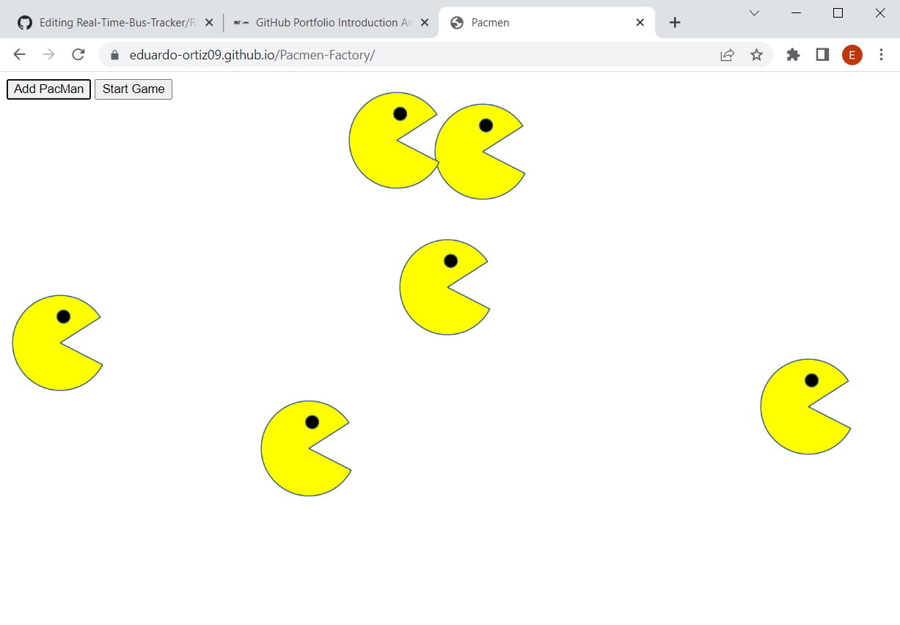

<div align="center" id="top">
     
</div>

# <h1 align="center">Pacmen-Factory</h1>

<p align="center">
  <a href="#dart-description">Description</a> &#xa0; | &#xa0; 
  <a href="#dart-demo">Demo</a> &#xa0; | &#xa0;
  <a href="#memo-improvements">Improvements</a> &#xa0; | &#xa0;
  <a href="#art-technologies">Technologies</a> &#xa0; | &#xa0;
  <a href="#white_check_mark-requirements">Requirements</a> &#xa0; | &#xa0;
  <a href="#toolbox-installation">Installation</a> &#xa0; | &#xa0;
  <a href="#joystickhow-to-play">How to Play</a> &#xa0; | &#xa0;
  <a href="#briefcase-license">License</a> &#xa0; | &#xa0;
  <a href="https://github.com/eduardo-ortiz09" target="_blank">Author</a>
</p>

<br>


## :dart: Description ##

This proyect is about a famous video game from the 80's that its a litlle face that is moving forward eating everything on its way. The proyect is part of the MERN Proggraming Certificate from the MIT that I am attending. 

## :dart: DEMO ##

If you want to try it just click [here](https://eduardo-ortiz09.github.io/Pacmen-Factory)

## :memo: Improvements ##

These are the list of currect improvements:

- :diamonds: Implent some updates that will allow modify the velocity of the pacmen at the preference of the user.	

## :art: Technologies ##

- [HTML](https://www.w3schools.com/html/)
- [CSS](https://www.w3schools.com/css/)
- [JavaScript](https://www.w3schools.com/js/)

## :white_check_mark: Requirements ##

Before starting :checkered_flag:, you need to have [Git](https://git-scm.com) installed.

## :toolbox: Installation ##

```bash
# Clone this project
$ git clone https://github.com/eduardo-ortiz09/Pacmen-Factory.git
# Access to directory
$ cd Pacmen-Factory
# Run index.html in a browser
```


## :briefcase:	 License ##

This project is under license from MIT. For more details, see the [LICENSE](LICENSE) file.


Made with :heart: by <a href="https://github.com/eduardo-ortiz09" target="_blank">Eduardo Ortiz</a>

&#xa0;

<a href="#top">Back to top</a>
